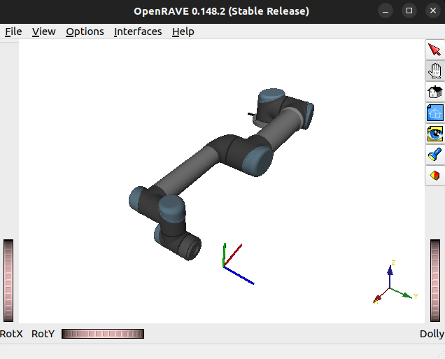

# Building OpenRAVE on Ubuntu 22.04 with Python 3.10

## Prerequisites
Environment:
- Ubuntu 22.04
- Python 3.10


## Using IKFast to Generate C++ Files for UR5 Robot

There are numerous guides on generating IKFast C++ files, primarily for older Ubuntu/ROS distributions. This guide focuses on getting it to work in newer environments.

For additional reference, see:
- [Framefab IRB6600 Support IKFast Tutorial](https://docs.ros.org/en/kinetic/api/framefab_irb6600_support/html/doc/ikfast_tutorial.html)
- [Generating an IKFast Solution for a 4-DOF Arm](https://answers.ros.org/question/263925/generating-an-ikfast-solution-for-4-dof-arm/)

### 1. Prepare Robot Model in Collada or OpenRAVE XML Format

We can prepare the robot model in several ways:

#### a. Using `collada_urdf` [Package](https://github.com/ros/collada_urdf/tree/port_to_ros2)
Convert URDF to Collada. Note:
1. Requires some work to build from source in ROS 2 Humble.
2. The exported Collada might be broken (tested with ROS 2 Humble).

#### b. Using [collada_world_exporter](https://gazebosim.org/api/sim/8/collada_world_exporter.html) Gazebo Plugin
Convert from SDF to Collada.

#### c. Writing the OpenRAVE XML from Scratch
1. This method can be time-consuming depending on the level of detail.
2. Found the documentation on OpenRAVE XML [here](https://web.archive.org/web/20220120162558/http://openrave.programmingvision.com/wiki/index.php/Format:XML#Custom_XML)
3. For IKFast generation, only minimal links and joints parameters are needed.
4. We can use the XML directly to generate the IKFast solution without converting it to Collada.
5. check the XML with `openrave.py <PATH TO XML>`



### 2. Generate IKFast C++ File

Run one of the following commands:

```bash
openrave.py --database inversekinematics --robot=<PATH_TO_ROBOT_XML_FILE> --maxcasedepth=1
```

or

```bash
python3 <PATH_TO_openrave/python/ikfast.py> --robot=<PATH_TO_ROBOT_XML_FILE> --iktype=transform6d --baselink=0 --eelink=6 --savefile=ikfast_ur5.cpp --maxcasedepth=1
```

Note: Setting `maxcasedepth` to 3 might prevent generation.

### 3. Test the IKFast Solution

```bash
openrave.py --database inversekinematics --robot=<PATH_TO_ROBOT_XML_FILE> --usecached --iktests=1000
```


## Issues and Fixes (written on 10/7/2024)

### 1. FCL Build Error

**Error**: `octree dont have .getChild`

**Cause**: The `getChild(...)` function was moved to `OcTreeBaseImpl::getNodeChild(...)` since [v1.8.0](https://github.com/OctoMap/octomap/releases/tag/v1.8.0).

**Fix**: Build OctoMap from source, using a version earlier than 1.8.0 (version used: v1.6.8).

**Additional Issue**: `reference to ‘byte’ is ambiguous`

**Fix**: Remove `using namespace std;` and prefix required items with `std::`.

### 2. OpenRAVE Build Error

**Error**: `'shared_mutex’ in namespace ‘std’ does not name a type`

**Cause**: `shared_mutex` requires C++17.

**Fix**: Update the code to use `boost::shared_mutex`. Reference [this issue](https://github.com/acxz/pkgbuilds/issues/148) for details.

### 3. Nose Error

**Error**: `AttributeError 'collections' has no attribute 'Callable'`

**Cause**: In Python 3.10, `collections.Callable` has been replaced with `collections.abc.Callable`.

**Fix**: Update the code to use `collections.abc.Callable`. Refer to [this issue](https://github.com/nose-devs/nose/issues/1122) for more information.


